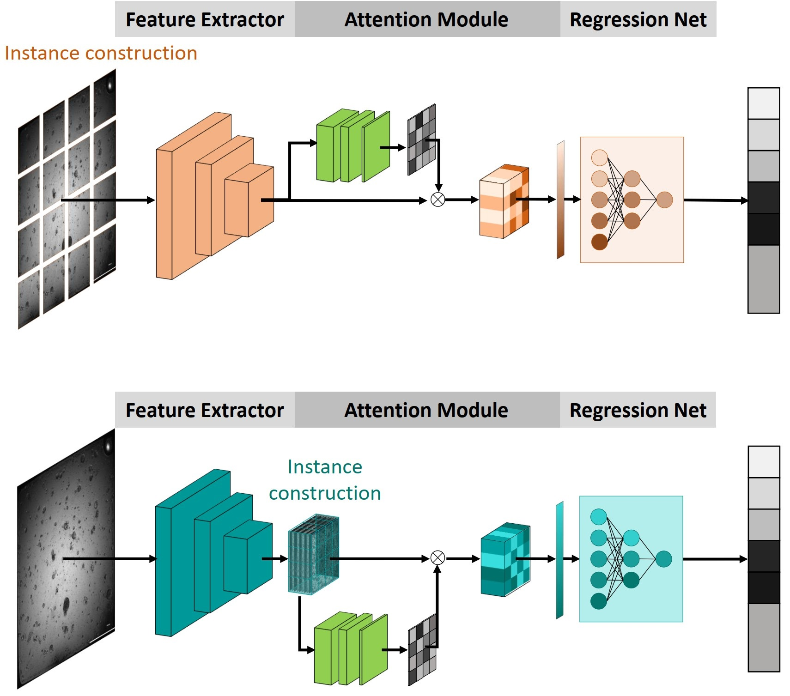
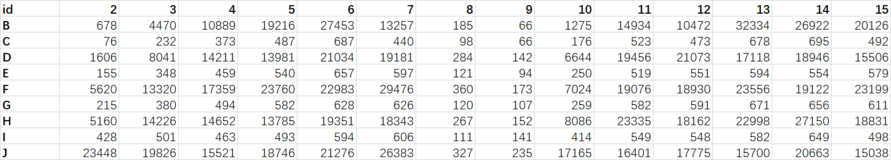
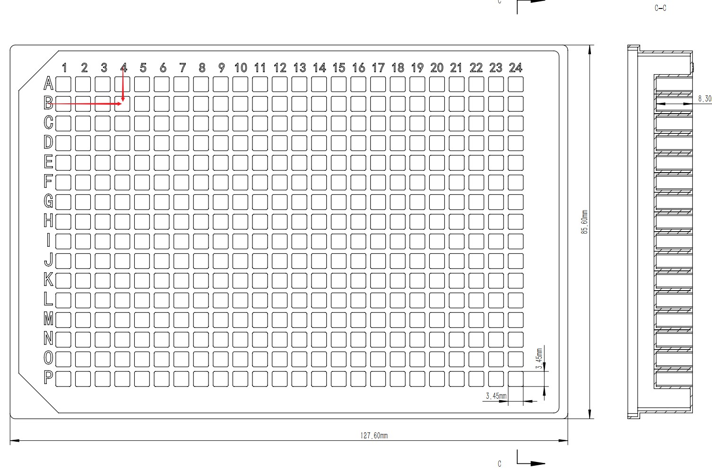

# Ins-ATP: Deep Estimation of ATP for Organoid Based on High Throughput Microscopic Images  

This is a open high-throughput organoid dataset for ATP Estimation. All organoids derive from tumour which are cultured in 394-well plate. We take all these image by BioTek Cytation5 cell imaging multi-mode reader.




## 1. Download

All users are available to access this dataset by this  [link](https://drive.google.com/file/d/1S_ZBLjGDhkUtvyplQnauPjZuy6bIz7VS/view?usp=sharing).

## 2. File organization

```shell
data
├─ATP_estimate_1 # group
│  ├─0747-2 # sample batch
│  │      ATP_0747.xlsx # ATP annotation
│  │      ZProj[Stitched[Bright Field]]_C3_1_001.tif # raw organoid image
│  │      ZProj[Stitched[Bright Field]]_C4_1_001.tif 
│  │      ...
│  │      
│  ├─0752-2
│  ├─0842-2
│  ├─0863-2
│  ├─...
├──ATP_estimate_2
├──ATP_estimate_3
```

### 2.1 raw


### 2.2 annotation



The ATP value corresponding to each image can be found in an Excel sheet based on the image file name. The location of the sample in the 384-well plate can be resolved from the image file name. For example, this file `ZProj[Stitched[Bright Field]]_CB_1_001.tif`, the `B4` in the file name indicates that the image was sampled from well `B4` in a 384-well plate, and the corresponding ATP value of 10889 can be found according to the `B4` position in the sheet.



## 3. Acknowledgement

The data are captured by Accurate International Biotechnology (GZ) Co., Ltd, Nanfang Hospital and Southern Medical University. All annotation are created by team of Fujian Key Laboratory of Sensing and Computing for Smart City, Xiamen University. The data is available for free to researchers for non-commercial use.